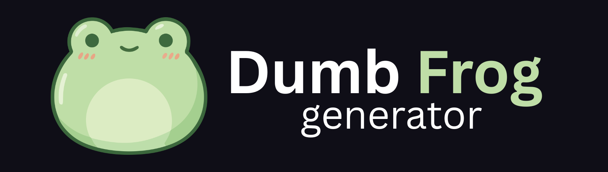

# Dumb-Frog Insult Generator

Dumb-Frog Insult Generator is a fun, interactive web app that generates witty, themed insults at the click of a button. From pirates to sci-fi villains, medieval knights to cyberpunks, this app delivers hilarious roasts for any mood or setting. It’s designed to be lightweight, responsive, and entertaining, making it perfect for a quick laugh or playful trolling among friends.

The project was created as a humorous experiment in combining random text generation with creative themes, animations, and light/dark mode support.

## 📍 Visit it Live

Visit it live at [https://dumb-frog-generator.github.io/](https://dumb-frog-generator.github.io/) and see this work.

## 🧱 Features

- Generate unique insults in multiple themes:
  - Classic, Pirate, Shakespearean, Tech Roast, Gamer Trash Talk, Medieval Knight, Sci-Fi, Cartoon Villain, Wizard, Vampire, Ninja, Robotpunk, and more
- Randomized combinations of adjectives, nouns, and verbs for fresh insults every time
- Smooth pop-in animation for insult text
- Toggle between Dark and Light mode
- Keyboard support: press **Enter** when the theme dropdown is selected to generate an insult
- Fully responsive and mobile-friendly design

## 🎨 How it works

- The user selects a theme from the dropdown menu
- The app randomly selects an adjective, noun, and verb from the chosen theme
- A pre-defined insult template is used to generate a complete insult
- The insult is displayed with an animation for a dynamic effect
- Optional dark/light mode toggling changes the color scheme dynamically

## 🔧 Adding New Themes

You can add your own themes by editing the `themes` object in the JavaScript file:

```javascript
themes["newTheme"] = {
  adjectives: ["funny", "silly"],
  nouns: ["unicorn", "goblin"],
  verbs: ["dance", "trip"],
};
```

Then add it to the HTML dropdown:

```html
<option value="newTheme">New Theme</option>
```

## 🖼️ Themes include

- Classic
- Pirate
- Shakespearean
- Tech Roast
- Gamer Trash Talk
- Medieval Knight
- Sci-Fi Roast
- Cartoon Villain
- Wizard
- Detective Noir
- Gothic Horror
- Chef’s Kitchen
- AI/Robot
- Drama Queen
- Wild West
- Greek Mythology
- Space Opera
- Cyberpunk
- Medieval Peasant
- Detective
- Circus
- Vampire
- Surfer
- Hacker
- Ninja
- Alien
- Royalty
- Librarian
- Zombie
- Mermaid
- Fairy
- Monk
- Robotpunk
- Dinosaur
- Witch
- Angel
- Monster
- Ghost

If you have any feedback, ideas, or bug reports, feel free to reach out to me at Squidly1408@gmail.com
